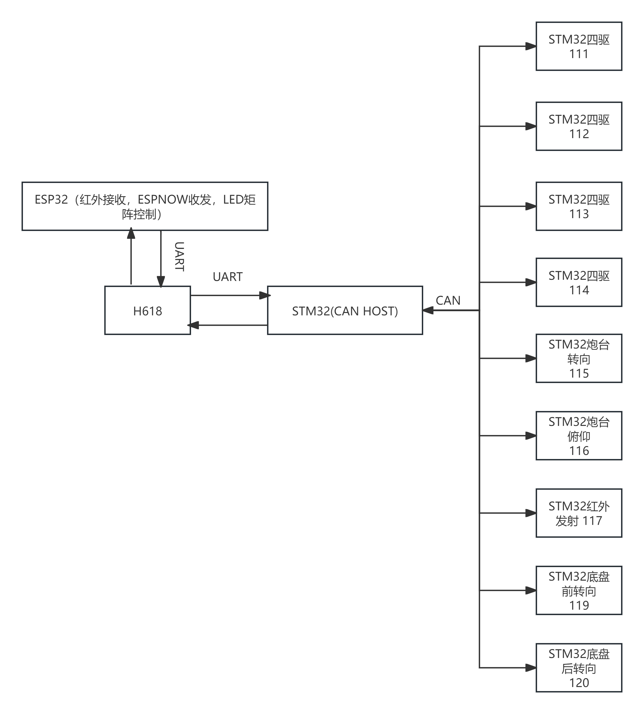
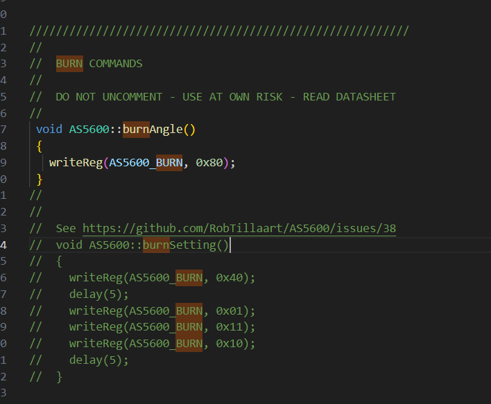
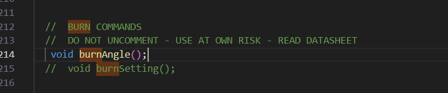
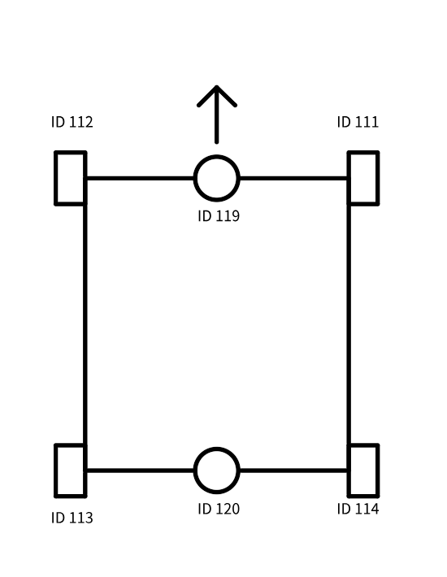
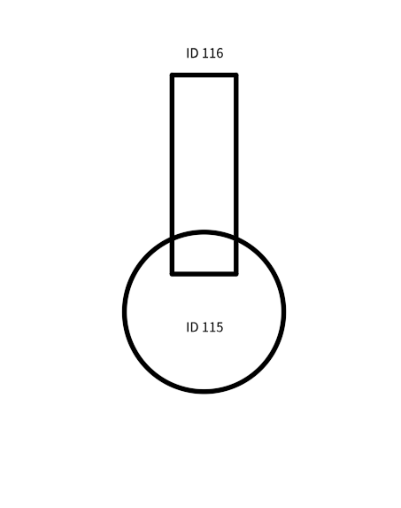
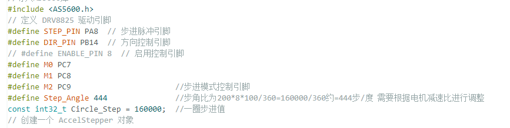
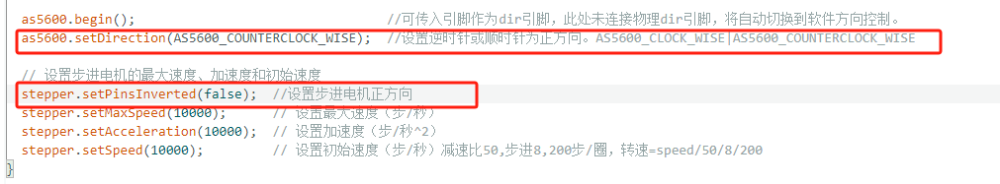

# **战车STM32 API文档**、

[TOC]


## **1. 概述**

战车 STM32源码说明文档及 BxCAN通讯数据帧格式及各ID对应的终端说明。



## **2. 硬件要求**

STM32F103RCT6/STM32F105RCT6

引脚分配表

|        定义名        | 对应IO |                             功能                             |
| :------------------: | :----: | :----------------------------------------------------------: |
|   MOTOR_POWER_PIN    |  PA4   |                         电机电源控制                         |
|    MOTOR_PWM_PIN     |  PA1   |                       电机PWM控制速度                        |
|    MOTOR_DIR_PIN     |  PB12  |                         电机方向控制                         |
|    MOTOR_HALL_PIN    |  PA2   |                        电机霍尔传感器                        |
|    MOTOR_LOCK_PIN    |  PC0   | 电机解锁引脚（开机先1后0进行解锁（开机默认锁定态），后续解锁也是先1后0）1解锁，0恢复常态 |
| MOTOR_LOCK_STATE_PIN |  PC1   |               电机锁定状态引脚（0锁定，1解锁）               |
|                      |        |                                                              |


|  定义名  | 对应IO |       功能       |
| :------: | :----: | :--------------: |
| STEP_PIN |  PA8   |   步进脉冲引脚   |
| DIR_PIN  |  PB14  |   方向控制引脚   |
|    M0    |  PC7   | 步进模式控制引脚 |
|    M1    |  PC8   | 步进模式控制引脚 |
|    M2    |  PC9   | 步进模式控制引脚 |
|          |        |                  |
|          |        |                  |


## **3. 安装与配置**

### **3.1 编译选项**

​	编译选择blue button F103RCT，optimize选择faster（-O2，debug时选择debug以便报错输出，USB support必须关闭为CAN让出IO口，此板子的模块设置了使用外部晶振并9倍频为72Mhz（Generic 板子的晶振设置为内部晶振8/2*16=64Mhz，未修改编译文件会导致许多频率敏感的库不可使用,故不可使用Generic配置）。同时设置了默认的串口为PA10,PA9故不用再定义串口。

### **3.2 库文件**

1. **QuickPID**

   [Dlloydev/QuickPID: A fast PID controller with multiple options. Various Integral anti-windup, Proportional, Derivative and timer control modes.](https://github.com/Dlloydev/QuickPID)

2. **eXoCAN**

   [exothink/eXoCAN： stm32duino CAN Library for the STM32F103 aka Blue Pill](https://github.com/exothink/eXoCAN)

3. **AccelStepper**

   [AccelStepper: AccelStepper library for Arduino](https://www.airspayce.com/mikem/arduino/AccelStepper/)

4. **AS5600**

   [RobTillaart/AS5600: Arduino library for AS5600 magnetic rotation meter](https://github.com/RobTillaart/AS5600)
   
   as5600库需要进行部分修改，其中burnAngle（）函数由于操作不安全默认注释，需要取消注释。
   
   
   
   
   
   

## **4. BxCAN数据帧格式**

### **4.1 底盘电机TXData**

**数据占位8位，有效位数7位，无效位置0.**

正常状态

```c++
uint8_t txData[8]{};                      //整数转化后的数组容器,第0位为状态代码，第1,2位为目标速度，第3,4位为当前速度，第5,6位为输出PWM。  
txData[0] = 'S';                          //正常代码S(speed)
txData[1] = Target_Speed & 0xFF;          // 获取最低字节
txData[2] = (Target_Speed >> 8) & 0xFF;   // 获取最高字节
txData[3] = Current_Speed & 0xFF;         // 获取最低字节
txData[4] = (Current_Speed >> 8) & 0xFF;  // 获取最高字节
txData[5] = (int)Output & 0xFF;           // 获取最低字节
txData[6] = ((int)Output >> 8) & 0xFF;    // 获取最高字节
```

堵转报错状态

```c++
//堵转检测
int Dog_Count = 0;
int Dog_Try = 0;
unsigned long Dog_Time[3]{};
void Watch_Dog() {
  if (digitalRead(MOTOR_LOCK_STATE_PIN) == 0 && Error_Flag != 1) {
    Dog_Count += 1;
    //电机锁死1S后尝试解锁脱困并将尝试次数加1
    if (Dog_Count >= 10) {
      digitalWrite(MOTOR_LOCK_PIN, HIGH);
      delay(10);
      digitalWrite(MOTOR_LOCK_PIN, LOW);
      Dog_Count = 0;
      Dog_Try += 1;
      Dog_Time[Dog_Try - 1] = millis();
      //如果锁死间隔大于30S，重置计数（即必须在30S内连续堵转3次才触发锁定）
      if (Dog_Try >= 2) {
        Serial.println("DG>=2");
        if ((Dog_Time[Dog_Try - 1] - Dog_Time[Dog_Try - 2]) >= 30000) {
          Serial.println("DG DROP");
          Dog_Try = 1;
          Dog_Time[0] = millis();
          Dog_Time[1] = 0;
          Dog_Time[2] = 0;
        }
      }
    }
    //尝试三次后错误标志置1，这将使loop中对错误标志的检测触发并开始持续1S间隔发送错误信号
    if (Dog_Try >= 3) {
      Dog_Try = 0;
      Error_Flag = 1;
    }
  }
}


uint8_t txData[8]{};                      //整数转化后的数组容器,第0位为状态代码，第1,2位为目标速度，第3,4位为当前速度，第5,6位为输出PWM。  
txData[0] = 'E';                          //正常代码S(speed)
txData[1] = Target_Speed & 0xFF;          // 获取最低字节
txData[2] = (Target_Speed >> 8) & 0xFF;   // 获取最高字节
txData[3] = Current_Speed & 0xFF;         // 获取最低字节
txData[4] = (Current_Speed >> 8) & 0xFF;  // 获取最高字节
txData[5] = (int)Output & 0xFF;           // 获取最低字节
txData[6] = ((int)Output >> 8) & 0xFF;    // 获取最高字节
```

### **4.2 底盘电机RXData**

```c++
uint8_t rxData[8]{};
void canISR()  // 依照setup中的过滤器配置来接收CAN消息
{
  can.receive(id, fltIdx, rxData);  // 从CAN总线接收数据（接收到的ID，成功匹配消息的过滤器的索引，接收到的数据）
  switch (rxData[0]) {
    case 'S':
      Target_Speed = (int16_t)((rxData[2] << 8) | rxData[1]);  //将接受数据转为16进制整数目标速度值
      break;
    case 'R':
      Recover_Flag = true;  //上位机电机解锁复位命令
      Error_Flag = 0;
      digitalWrite(MOTOR_LOCK_PIN, HIGH);
      delay(1);
      digitalWrite(MOTOR_LOCK_PIN, LOW);
      Recover_Flag = false;
      break;
  }
}

```

rxData[0]=‘S’：从rxData[1]，rxData[2]更新Target_Speed；

rxData[0]-‘R’：解锁电机；

### **4.3 底盘转向电机TXData**

**数据占位8位，有效位数5位，无效位置0.**

```c++
//上报当前角度数据
uint8_t txData[8]{};  //整数转化后的数组容器,第0位为状态代码，第1,2位为目标角度，第3,4位为当前角度。
int txDataLen = 8;
void Send_Data() {
  int Current_Angle_10 = (int)(Current_Angle * 10);
  txData[0] = Error_Flag ? 'E' : 'A';  //依据Error_Flag状态进行三元运算。正常代码A(angle)，错误代码E
  Error_Flag = false;
  txData[1] = Target_Angle_10 & 0xFF;          // 获取最低字节
  txData[2] = (Target_Angle_10 >> 8) & 0xFF;   // 获取最高字节
  txData[3] = Current_Angle_10 & 0xFF;         // 获取最低字节
  txData[4] = (Current_Angle_10 >> 8) & 0xFF;  // 获取最高字节
  can.transmit(txMsgID, txData, txDataLen);
}
```


### **4.4 底盘转向电机RXData**

```c++
//设置CAN接收回调
int id, fltIdx = 0;
bool Request_Flag = false;
bool Target_Flag = true;
bool Set_Zpos_Flag = false;
bool Send_Data_Flag = false;
volatile uint8_t rxData[8];  // 声明一个 8 字节数组来接收数据
void canISR()                // 依照setup中的过滤器配置来接收CAN消息
{
  can.receive(id, fltIdx, rxData);  // 从CAN总线接收数据（接收到的ID，成功匹配消息的过滤器的索引，接收到的数据）
  switch (rxData[0]) {
    case 'A':  //更新目标位置
      Target_Flag = true;
      Target_Angle_10 = (int16_t)((rxData[2] << 8) | rxData[1]);  //将接受数据转为16进制整数目标角度值
      Target_Angle = Target_Angle_10 / 10;
      break;
    case 'R':  //上报当前角度
      Send_Data_Flag = true;
      break;
    case 'Z':  //执行零位归零
      Set_Zpos_Flag = true;
      break;
  }
}
```

```c++
//电机控制（结合AS5600读数进行闭环控制（对角度和步数进行实时同步））
//步角比为200*8*100/360=160000/360约=444步/度
int16_t Target_Step = 0;  //转化后的目标位置（步数）
void Ctrl_42() {
  //如果接收到新的Target,设定一次新目标。
  if (Target_Flag) {
    Target_Flag = false;  //执行后标志置否
    Target_Step = (int)(Target_Angle * Step_Angle);
    stepper.moveTo(Target_Step);
  }
}
```

```c++
//将霍尔传感器当前位置设为0位，危险操作，请确认角度正确后再执行烧写
void Set_Zpos() {
  if (Set_Zpos_Flag) {
    Set_Zpos_Flag = false;
    int a = as5600.rawAngle();
    as5600.setZPosition(a);
    as5600.burnAngle();
  }
}
```


### **4.5 各位置CANID详情**

针对每个CAN终端的操控通过不同报文ID来实现。





### **4.6 炮台转向电机TxData**

**数据占位8位，有效位数5位，无效位置0.**

```c++
float Target_Offset_Angle = 0;       //目标偏移角度
int16_t Target_Offset_Angle_10 = 0;  //10倍目标偏移角度000--3600
void Closed_Loop() {
  Current_Angle = as5600.readAngle() * AS5600_RAW_TO_DEGREES;
  Target_Offset_Angle = (float)stepper.distanceToGo() / (float)Circle_Step * 360;
  Target_Offset_Angle_10 = Target_Offset_Angle * 10;
  Send_Data();
}


uint8_t txData[8]{};  //整数转化后的数组容器,第0位为状态代码，第1,2位为剩余偏移角度，第3,4位为当前角度的10倍值。
int txDataLen = 8;
void Send_Data() {
  int Current_Angle_10 = (int)(Current_Angle * 10);
  txData[0] = 'A';                                   //正常代码A(angle)
  txData[1] = Target_Offset_Angle_10 & 0xFF;         // 获取最低字节
  txData[2] = (Target_Offset_Angle_10 >> 8) & 0xFF;  // 获取最高字节
  txData[3] = Current_Angle_10 & 0xFF;               // 获取最低字节
  txData[4] = (Current_Angle_10 >> 8) & 0xFF;        // 获取最高字节
  can.transmit(txMsgID, txData, txDataLen);
}
```

### **4.7 炮台转向电机RxData**

```c++
//设置CAN接收回调
int id, fltIdx = 0;
bool Target_Flag = true;
bool Set_Zpos_Flag = false;
bool Send_Data_Flag = false;
volatile uint8_t rxData[8];  // 声明一个 8 字节数组来接收数据
void canISR()                // 依照setup中的过滤器配置来接收CAN消息
{
  can.receive(id, fltIdx, rxData);  // 从CAN总线接收数据（接收到的ID，成功匹配消息的过滤器的索引，接收到的数据）
  // Serial.println(id);
  switch (rxData[0]) {
    case 'A':  //更新目标位置
      Target_Flag = true;
      Offset_Angle_10 = (int16_t)((rxData[2] << 8) | rxData[1]);  //将接受数据转为16进制整数目标角度值
      Offset_Angle = Offset_Angle_10 / 10;
      break;
    case 'R':  //上报当前角度
      Send_Data_Flag = true;
      break;
    case 'Z':  //执行零位归零
      Set_Zpos_Flag = true;
      break;
  }
}


//电机控制（结合AS5600读数进行闭环控制（对角度和步数进行实时同步））
int32_t Offset_Step = 0;  //需要对目标步数进行偏移的上位机命令步数
void Ctrl_42() {
  //如果接收到新的Target,设定一次新目标。
  if (Target_Flag) {
    Target_Flag = false;  //执行后标志置否
    Offset_Step = (int)(Offset_Angle * Step_Angle);
    stepper.move(Offset_Step);  //move函数的本质是对targetposition的值进行加减
  }
}


//将霍尔传感器当前位置设为0位，危险操作，请确认角度正确后再执行烧写
void Set_Zpos() {
  if (Set_Zpos_Flag) {
    Set_Zpos_Flag = false;
    int a = as5600.rawAngle();
    as5600.setZPosition(a);
    as5600.burnAngle();
  }
}


  if (currentTime - lastTime >= 500 || Send_Data_Flag == true) {
    if (Send_Data_Flag) {
      Send_Data_Flag = false;
    }
    // Serial.println("close running");
    Closed_Loop();
    lastTime = currentTime;  // 更新计算时间
  }
```

### **4.8 炮台俯仰电机TxData**

**数据占位8位，有效位数5位，无效位置0.**

```c++
//上报当前角度数据
uint8_t txData[8]{};  //整数转化后的数组容器,第0位为状态代码，第1,2位为目标角度，第3,4位为当前角度。
int txDataLen = 8;
void Send_Data() {
  int Current_Angle_10 = (int)(Current_Angle * 10);
  int Target_Angle_10 = (int)(Target_Angle * 10);
  txData[0] = Error_Flag ? 'E' : 'A';  //依据Error_Flag状态进行三元运算。正常代码A(angle)，错误代码E
  Error_Flag = false;
  txData[0] = 'A';                             //正常代码A(angle)
  txData[1] = Target_Angle_10 & 0xFF;          // 获取最低字节
  txData[2] = (Target_Angle_10 >> 8) & 0xFF;   // 获取最高字节
  txData[3] = Current_Angle_10 & 0xFF;         // 获取最低字节
  txData[4] = (Current_Angle_10 >> 8) & 0xFF;  // 获取最高字节
  can.transmit(txMsgID, txData, txDataLen);
}
```

### **4.9 炮台俯仰电机RxData**

```c++
//设置CAN接收回调
int id, fltIdx = 0;
bool Request_Flag = false;
bool Target_Flag = true;     //每次重启后默认设置一次目标进行归位
bool Set_Zpos_Flag = false;  //归零标志
bool Send_Data_Flag = false;
bool Error_Flag = false;     //错误标志
volatile uint8_t rxData[8];  // 声明一个 8 字节数组来接收数据
void canISR()                // 依照setup中的过滤器配置来接收CAN消息
{
  can.receive(id, fltIdx, rxData);  // 从CAN总线接收数据（接收到的ID，成功匹配消息的过滤器的索引，接收到的数据）
  // Serial.println(id);
  switch (rxData[0]) {
    case 'A':  //更新目标位置
      Target_Flag = true;
      Target_Offset_Angle_10 = (int16_t)((rxData[2] << 8) | rxData[1]);  //将接受数据转为16进制整数目标角度值
      Target_Offset_Angle = Target_Offset_Angle_10 / 10;
      break;
    case 'R':  //上报当前角度
      Send_Data_Flag = true;
      break;
    case 'Z':  //执行零位归零
      Set_Zpos_Flag = true;
      break;
  }
}


//电机控制（结合AS5600读数进行闭环控制（对角度和步数进行实时同步））
//步角比为200*8*100/360=160000/360约=444步/度
int16_t Target_Step = 0;  //转化后的目标位置（步数）
void Ctrl_42() {
  //如果接收到新的Target,设定一次新目标。
  if (Target_Flag) {
    Target_Flag = false;                             //执行后标志置否
    Target_Angle += Target_Offset_Angle;             //将偏移值加到目标值上
    Target_Angle = constrain(Target_Angle, 0, 60);   //确保最终角度值范围在0.0-60.0之间
    Target_Step = (int)(Target_Angle * Step_Angle);  //输出目标步数并输入Moveto函数
    stepper.moveTo(Target_Step);
  }
}


void Closed_Loop() {
  Raw_Angle = as5600.readAngle() * AS5600_RAW_TO_DEGREES;  //传感器角度范围为0.00——60.00。
  //极限机械可达角度范围为0——70
  Current_Angle = (Raw_Angle > 180) ? (Raw_Angle - 360) : Raw_Angle;  //Raw_Angle > 180 时，Current_Angle = Raw_Angle - 360。否则，直接赋值 Raw_Angle。
  Error_Flag = (Current_Angle > 70 || Current_Angle < 0);             //如果超过实际可达范围，错误标志置真
  Current_Step = Current_Angle * Step_Angle;                          //霍尔获取的实际位置

  if (abs(stepper.currentPosition() - Current_Step) >= 400) {  //尝试修改为abs(stepper.currentPosition()-Current_Step)>=400
    stepper.updateCurrentPosition(Current_Step);
  }
```

### 4.10 ESP32红外接收、ESPNOW收发、LED矩阵控制说明

1. 通过串口命令“MAC”可以让esp32返回自身的MAC地址
2. 通过串口命令"SHOOT",可以让esp32 接收红外信号0.5秒并发送"Hit!"消息到所接受到的MAC地址所在的esp32处。（非阻塞）返回消息发送状态及目标MAC地址
3. ESP32监听ESPNOW消息，如收到“Hit!”，控制LED矩阵播放受击动画（非阻塞）。动画效果如下所示，自内而外依次亮起并熄灭。


## **5. 串口控制示例代码**

接收的数据格式：

**ID 111 S 2000 2000 100(ID+CANID+目标速度+当前速度+当前PWM值)**

**ID 119 A 200 200 1（ID+CANID+目标角度（目标偏移角度）+当前角度+AS5600已被归零次数）**

控制：

**ID 114 S 2000**

**ID 119 A 400（-400）**

**ID 119 Z**

**ID 114 R**

```c++
//导入exoCAN
#include <eXoCAN.h>
#define Rx0 PA10
#define TX0 PA9
#define Rx1 PA3
#define Tx1 PA2
HardwareSerial Serial2(Rx1, Tx1);  // RX1=PA3, TX1=PA2

//CAN设置
int rxMsgID = 111;
eXoCAN can(STD_ID_LEN, BR250K, PORTA_11_12_XCVR);

//CAN数据结构体
struct CanMessage {
  uint8_t data[8];  // 存储 8 字节数据
  bool updated;     // 标志位，表示数据是否更新
};

//设置CAN接收回调
int id, fltIdx = 0;
bool Rec_Flag = false;
// volatile uint8_t* rxData_2[9];  // 声明一个 9位指针数组来暂存数据
uint8_t rxData[8];        // 声明一个 8 字节一维数组来接收数据
CanMessage rxData_2[10];  // 存储数据
void canISR()             // 依照setup中的过滤器配置来接收CAN消息
{
  can.receive(id, fltIdx, rxData);  // 从CAN总线接收数据（接收到的ID，成功匹配消息的过滤器的索引，接收到的数据）
  // Serial.println(id);
  int index = id - 111;
  if (index >= 0 && index <= 9) {
    memcpy(rxData_2[index].data, rxData, 8);  //复制8位接收数据到结构体的data中。
    rxData_2[index].updated = true;           // 标记数据已更新
  }
}

void Uart_Send() {
  for (int i = 0; i < 4; i++) {
    if (rxData_2[i].updated) {
      char buffer[20];
      sprintf(buffer, "ID:%d %c %d %d %d", i + 111, rxData_2[i].data[0], (int16_t)(rxData_2[i].data[2] << 8 | rxData_2[i].data[1]), (int16_t)(rxData_2[i].data[4] << 8 | rxData_2[i].data[3]), (int16_t)(rxData_2[i].data[6] << 8 | rxData_2[i].data[5]));
      Serial.println(buffer);
      Serial.println();
      rxData_2[i].updated = false;  // 处理完成后清除标志
    }
  }
  for (int i = 4; i < 10; i++) {
    if (i == 6 || i == 7) {
      continue;
    }
    if (rxData_2[i].updated) {
      char buffer[20];
      sprintf(buffer, "ID:%d %c %d %d %d", i + 111, rxData_2[i].data[0], (int16_t)(rxData_2[i].data[2] << 8 | rxData_2[i].data[1]), (int16_t)(rxData_2[i].data[4] << 8 | rxData_2[i].data[3]), rxData_2[i].data[5]);
      Serial.println(buffer);
      Serial.println();
      rxData_2[i].updated = false;  // 处理完成后清除标志
    }
  }
}

//CAN消息预设
void Run(int txMsgID, int16_t Target_Speed) {
  uint8_t txData[3]{};
  int txDataLen = 3;
  txData[0] = 'S';                         //正常代码S(speed)
  txData[1] = Target_Speed & 0xFF;         // 获取最低字节
  txData[2] = (Target_Speed >> 8) & 0xFF;  // 获取最高字节
  can.transmit(txMsgID, txData, txDataLen);
}
void Cmd_R(int txMsgID) {
  uint8_t txData[1]{};
  int txDataLen = 1;
  txData[0] = 'R';  //复位代码R(recover)
  can.transmit(txMsgID, txData, txDataLen);
}
void Angle(int txMsgID, int16_t Target_Angle_10) {
  uint8_t txData[3]{};
  int txDataLen = 3;
  txData[0] = 'A';                            //正常代码A(angle)
  txData[1] = Target_Angle_10 & 0xFF;         // 获取最低字节
  txData[2] = (Target_Angle_10 >> 8) & 0xFF;  // 获取最高字节
  can.transmit(txMsgID, txData, txDataLen);
}
void Read_Angle(int txMsgID) {
  uint8_t txData[1]{};
  int txDataLen = 1;
  txData[0] = 'R';  //读取代码R(read)
  can.transmit(txMsgID, txData, txDataLen);
}
void Set_ZPos(int txMsgID) {
  uint8_t txData[1]{};
  int txDataLen = 1;
  txData[0] = 'Z';  //归零代码Z(Zero)
  can.transmit(txMsgID, txData, txDataLen);
}

void Uart_To_Can() {
  if (Serial.available()) {
    String command = Serial.readStringUntil('\n');  // 读取一整行命令
    command.trim();                                 // 去除首尾空格
    Serial.println("Received: " + command);         // 打印接收到的指令

    int id, value;
    char cmd;

    // 解析串口指令格式: "ID 111 S 1000"
    if (sscanf(command.c_str(), "ID %d %c %d", &id, &cmd, &value) > 2) {
      Serial.print("Parsed ID: ");
      Serial.println(id);
      Serial.print("Parsed CMD: ");
      Serial.println(cmd);
      if (cmd == 'S') {
        Serial.print("Parsed Speed: ");
        Serial.println(value);
        Run(id, value);  // 发送速度命令
      } else if (cmd == 'A') {
        Serial.print("Parsed Angle: ");
        Serial.println(value);
        Angle(id, value);  // 发送角度命令
      } else {
        Serial.println("⚠ 未知指令");
      }
    }
    // 解析无参数命令 (如 "ID 119 R")
    else if (sscanf(command.c_str(), "ID %d %c", &id, &cmd) == 2) {
      Serial.print("Parsed ID: ");
      Serial.println(id);
      Serial.print("Parsed CMD: ");
      Serial.println(cmd);
      if (cmd == 'R') {
        Cmd_R(id);  // 复位命令或角度读取命令
      } else if (cmd == 'Z') {
        Set_ZPos(id);  // 归零命令
      } else {
        Serial.println("⚠ 未知指令");
      }
    } else {
      Serial.println("⚠ 指令格式错误");
    }
  }
}
void setup() {
  Serial.begin(115200);
  Serial2.begin(115200);


  //CAN初始化
  can.attachInterrupt(canISR);              //注册CAN接收回调
  can.filterMask16Init(0, rxMsgID, 0x000);  // 设置CAN过滤器0，准许IDrxMsgID,掩码0x000
}

void loop() {
  Uart_Send();
  Uart_To_Can();
}

```


## **6. 注意事项**

AS5600每个传感器只能设置ZPOS三次，三次之后OTP失效，将无法更改ZPOS。



不同减速比、步进数的步进电机的步角比都不同，注意修改Step_Angle和Circle_Step.

AS5600的正方向硬件上设置为顺时针正方向，软件方向建议设置为顺时针正方向（软件的所谓顺时针正方向其实是不对读取值做任何改变，反之将对其进行取反运算，即350°变10°，10°变350°）。这将导致后续归零步骤出现问题。

## **7. 常见问题（FAQ）**

如果步进电机出现指定角度后一直旋转或方向不对的问题，可能是步进电机正方向和AS5600正方向相反，可以通过调整此函数来改变步进电机的正方向，AS5600的不建议进行更改。



由于步进电机安装方向各不相同，步进电机的正方向需要依据实际情况改变。

## **8. 版本历史**